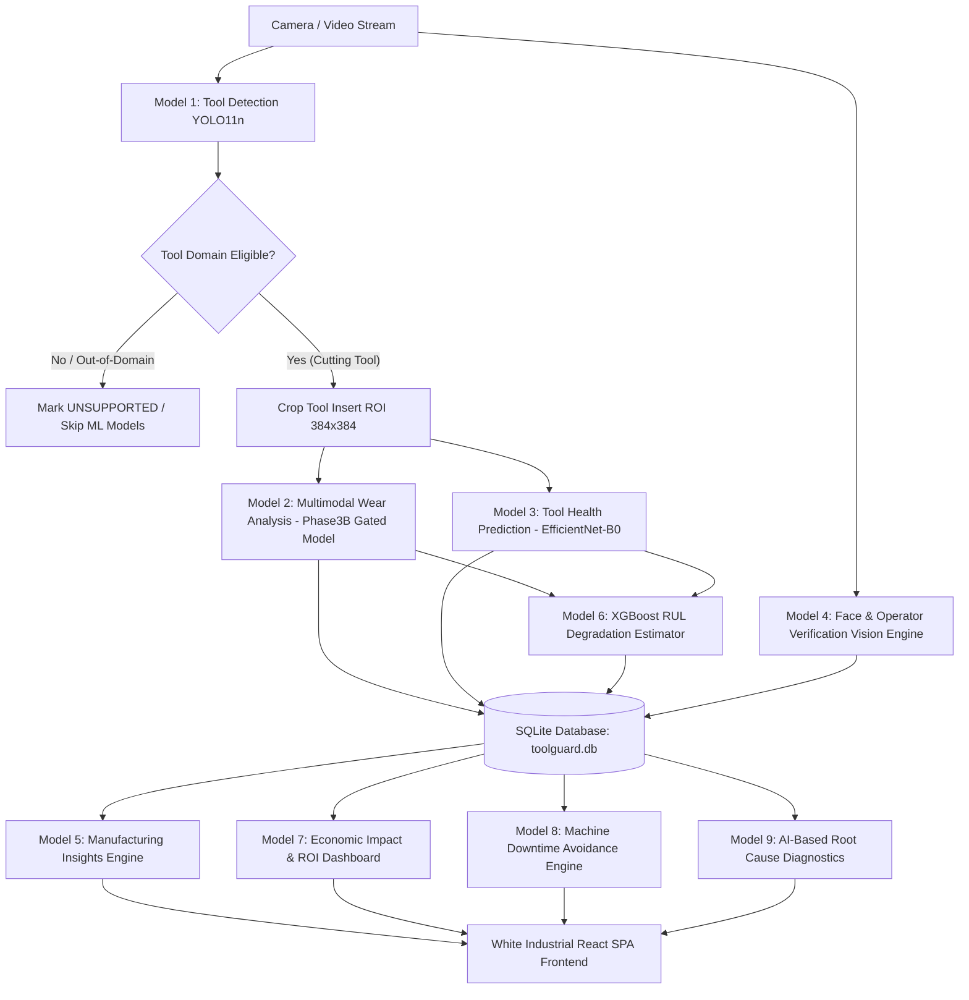

# ToolGuard-AI: System Architecture & Intelligence Pipeline

## 1. Executive Overview
**ToolGuard-AI** is an industrial predictive-maintenance and computer-vision intelligence system designed for CNC turning and milling operations. It unifies deep learning vision models, machine learning degradation estimators, multimodal sensor fusion, and plant-level business analytics into a zero-cold-start, real-time inspection system.

---

## 2. AI & Software Intelligence Architecture

| Model ID | Module Name | Architecture / Framework | Input Modalities | Primary Output Target |
| :--- | :--- | :--- | :--- | :--- |
| **Model 1** | Tool Detection | Ultralytics YOLO11n (640×640) | Optical BGR Frame | Insert BBox `[x1, y1, x2, y2]`, Class `{0: cutting_tool}`, Confidence |
| **Model 2** | Tool Wear Analysis | PyTorch `Phase3BGatedModel` (EfficientNet-B0 + Sensor MLP + Gate) | 384×384 ROI + Sensor MLP | Flank Wear $VB$ in $\mu\text{m}$ (via `target_scaler.pkl`) & $\text{mm}$ |
| **Model 3** | Tool Health Diagnostic | PyTorch `ImageOnlyWearModel` (EfficientNet-B0) | 384×384 ROI Crop | Continuous Wear ($\mu\text{m}$), Health Score (0-100%), Status (HEALTHY/WARNING/CRITICAL) |
| **Model 4** | Operator Auth & Tracking | YOLO + OpenCV Template Vision Engine | 640×480 Optical Frame | Operator Identity Match, Confidence, Workshop Presence |
| **Model 5** | Manufacturing Insights | SQLite Statistical Analytics Engine | Historical Inspections | Wear Acceleration ($\Delta\text{wear}/\Delta\text{cyc}$), Machine Variance, Maintenance Prioritization |
| **Model 6** | Remaining Useful Life (RUL) | XGBoost `RULModelPackage` (89-Feature Schema) | 86 Numerical + 3 Categorical Features | Wear Rate ($\mu\text{m}/\text{cycle}$), Remaining Cutting Cycles to $300\,\mu\text{m}$ EOL |
| **Model 7** | Economic Impact Dashboard | Plant Financial Intelligence Service | Configurable Cost Rates & Downtime | Actual vs Estimated Downtime Losses, Maintenance Labor, Avoided Cost Savings |
| **Model 8** | Machine Downtime Avoidance | Production Reliability Service | Planned vs Unplanned Stoppage Logs | Avoided Stoppage Hours (hrs), Machine Stoppage Breakdown, Financial Stoppage Loss |
| **Model 9** | AI Root Cause Analysis | Statistical Feature Contribution Engine | Machine RPM, Feed, Cut Depth, Temp, Vib | Ranked Factor Importances, Deviations from Nominal Baselines, Non-Causal Explanations |

---

## 3. Tool Domain Eligibility Protection
To prevent fabricating spurious wear or health predictions on out-of-domain objects (e.g. human hands, random tools, blank lens caps):
1. **Low-Contrast / Blank Rejection**: Images with $\sigma < 6.0$ or $\mu < 4.0$ are immediately rejected as `NO_TOOL`.
2. **Domain Classification Check**: Model 1 validates whether the localized object belongs to `{0: 'cutting_tool'}` with confidence $\ge 0.40$.
3. **Graceful Model Isolation**: If tool eligibility is `UNSUPPORTED` or `NO_TOOL`, downstream Models 2, 3, and 6 are marked `SKIPPED` with message *"Unsupported tool for current wear-analysis model."*, ensuring data integrity.

---

## 4. SQLite Data Persistence Schema
- **`tools`**: Physical CNC tool registry (insert shape, material, coating, machine assignment, current wear $\mu\text{m}$, VB $\text{mm}$, RUL cycles, wear rate).
- **`inspections`**: Multi-model inspection telemetry records (tool detection confidence, wear VB $\text{mm}$, wear $\mu\text{m}$, health score, RUL cycles, temperature, vibration, RPM, feed rate, depth of cut, original and HUD annotated image paths).
- **`machines`**: CNC machine cells (lathes, mills, location, status).
- **`operators`**: Registered machine operators and face templates.
- **`maintenance_events`**: Planned tool replacements, preventive servicing, durations, and costs.
- **`downtime_events`**: Planned maintenance windows vs unplanned emergency stoppages and estimated avoided hours.
- **`economic_parameters`**: Plant operating parameters (tool replacement cost, downtime cost/hr, machine operating cost/hr, technician labor rate/hr, currency symbol).
- **`alerts`**: Real-time threshold breach notifications (wear $> 220\,\mu\text{m}$ or RUL $\le 30$ cycles).

---

## 5. Frontend Design Philosophy
Built in React 18 + Vite + TypeScript using the **White Industrial UI Design System**:
- Clean `#FFFFFF` card surfaces, `#E2E8F0` subtle borders, and `#0F172A` high-contrast typography.
- Industrial Blue (`#0284C7`), Emerald Success (`#059669`), Amber Warning (`#D97706`), and Rose Critical (`#E11D48`).
- Strict provenance badges for financial metrics (`ACTUAL`, `ESTIMATED`, `SIMULATED`).
- Dedicated tabs and pages for all 9 models with complete live telemetry.
