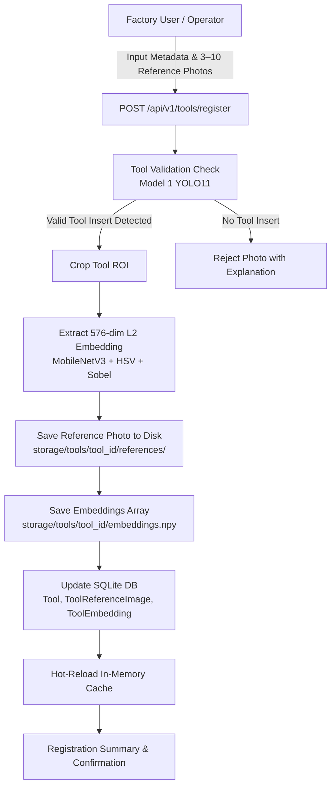

# Tool Registration & Visual Reference Image System

## Overview
The **Tool Reference Matching System** in ToolGuard-AI enables factory operators to register physical CNC cutting tools in the **Tool Inventory** with multi-angle reference photos (3–10 photos) for automated visual identification.

### Architectural Principle: Zero YOLO Retraining
Adding a new physical tool to inventory **DOES NOT RETRAIN YOLO** and **DOES NOT MODIFY GLOBAL MODEL WEIGHTS** (`best.pt`).

Instead, the system utilizes a high-performance **Two-Layer Vision Architecture**:
1. **Global Detector Layer (Model 1 - YOLO11n)**: Detects the cutting tool insert and localizes the exact bounding box ROI $[x_1, y_1, x_2, y_2]$ in the image.
2. **Tool Registry Matching Layer (Few-Shot Visual Embedding)**:
   - Crops the cutting tool ROI.
   - Computes a **576-dimensional L2-normalized feature embedding vector** combining:
     - **512-dim Deep CNN Features**: MobileNetV3 feature backbone with adaptive average pooling.
     - **32-dim HSV Color Distribution**: Quantized hue, saturation, and value histograms.
     - **32-dim Edge Orientation Descriptor**: Sobel gradient magnitude and orientation histogram.
   - Evaluates **cosine similarity** $S(\vec{q}, \vec{r}_i) = \vec{q} \cdot \vec{r}_i$ against all registered reference embeddings stored in memory and on disk (`storage/tools/<tool_id>/embeddings.npy`).

---

## Tool Registration Workflow

---

## Visual Matching Decision Logic

During image inspection or live camera frame analysis:
1. **Model 1 Detection**: YOLO detects the tool bounding box.
2. **Feature Extraction**: 576-dim embedding vector $\vec{q}$ is computed for the detected tool insert.
3. **Similarity Scoring**: Cosine similarity $S$ is calculated against all registered physical tool profiles:
   $$\text{Score} = 0.70 \times \max(S) + 0.30 \times \text{mean}(\text{top-3}(S))$$
4. **Decision Boundary**:
   - If $\text{Score} \ge \text{TOOL\_MATCH\_THRESHOLD}$ (default: `0.75`):
     - **Match Status**: `CONFIRMED`
     - **Tool ID**: Assigned to the matched tool profile (`T-014`).
     - **Pipeline**: Passes identified tool metadata to downstream Wear Analysis (Model 2), Health Prediction (Model 3), and RUL (Model 6).
   - If $\text{Score} < \text{TOOL\_MATCH\_THRESHOLD}$:
     - **Match Status**: `UNKNOWN_TOOL`
     - **Message**: *"The tool was detected, but no registered tool matched the available reference images."*
     - **UI Action**: Displays amber notification with a `[ + Register This Tool ]` prompt.

---

## Recommended Reference Photo Guidelines

For optimal identification accuracy across different machine setups:
- **Quantity**: 3 to 10 photos per physical tool.
- **Angle 1**: Front flank face view (direct optical view).
- **Angle 2**: Rake face (top surface / chipbreaker view).
- **Angle 3**: Side profile / clearance angle view.
- **Angle 4**: Macro close-up of cutting nose radius.
- **Angle 5**: Rotated orientation ($90^\circ$ or $180^\circ$).
- **Angle 6**: Natural workshop lighting / illumination variation.

---

## Configuration Settings (`backend/core/config.py`)

| Setting | Default Value | Description |
| :--- | :--- | :--- |
| `TOOL_MATCH_THRESHOLD` | `0.75` | Cosine similarity threshold for confirmed tool identification |
| `TOOL_STORAGE_DIR` | `storage/tools` | Root directory storing reference photos and `.npy` embedding matrices |
| `IMAGE_SIZE` | `640` | YOLO11 input resolution |
| `WEAR_IMAGE_SIZE` | `384` | Model 2 Multimodal Wear Analysis resolution |
